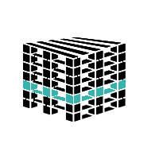
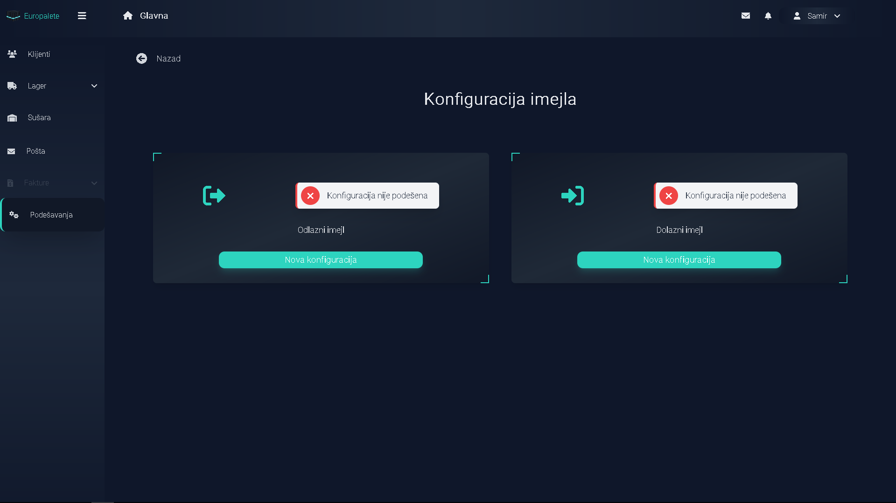

<div id="top"></div>

<br />
<div align="center">
  <a href="https://github.com/github_username/repo_name">
    
  </a>

<h3 align="center">Dry Kiln web application</h3>

  <p align="center">
    Web app for dry kiln management.
    <br />
    <br />
    <a href="https://hersarma.in.rs" target="_blank">View Demo</a>
    <br />
    <br />
  </p>
</div>

## Built With

* [Laravel](https://laravel.com)
* [Tailwindcss](https://tailwindcss.com)
* [JQuery](https://jquery.com)

### Installation

1. Clone the repo
   ```sh
   git clone https://github.com/Hersarma/Drying-kiln-management.git
   ```
   
   ```sh
    cd Drying-kiln-management
   ```
2. Install and run NPM packages
   ```sh
   npm install && nmp run
   ```
3. Create database

4. Create and edit .env file with database credentials

5. Create APP_KEY in .env file
    ```sh
   php artisan key:generate
   ```
6. Run migrations

7. Run seeders
   ```sh
   php artisan db:seed
   ```
8. Login with username->admin@admin.com, password->admin

9. Change your login credentials in app settings

### Email usage locally

1.Create an email account at your hosting provider

2. Edit email config in app settings

<div align="left">
  
</div>

3. Get mail locally
 Run artisan command
   ```sh
   php artisan mail:get
   ```
### Email usage shared hosting
4. Create cron job
/usr/local/bin/php /home/path/to/cron/script/artisan mail:get
